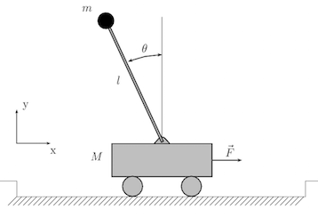

##OpenaI Gym environment for Modelica models 
In this blog post I will show how to combine dynamic models from [Modelica](https://www.modelica.org/) with reinforcement learning.

As part of one of my master projects a software environment was developed to examine reinforcement learning algorithms on existing dynamic models from Modelica in order to solve control tasks. Modelica is a non-proprietary, object-oriented, equation based language to conveniently model complex physical systems [1].

The result is the Python library **Dymola Reinforcement Learning (dymrl)** which allows you to explore reinforcement learning algorithms for dynamical systems.

The code of this project can be found at [github](https://github.com/eyyi/dymrl). 

### What is reinforcement learning?
A good and compact definition of reinforcement learning is given by Csaba Szepesv: 

> Reinforcement learning is a learning paradigm concerned with learning to control a system so as to maximize a numerical performance measure that expresses a long-term objective. What distinguishes reinforcement learning from supervised learning is that only partial feedback is given to the learner about the learner’s predictions. Further, the predictions may have long term effects through influencing the future state of the controlled system [2].


### Dymola Reinforcement Learning (dymrl)
*Dymola Reinforcement Learning* is a library to examine reinforcement learning algorithms on dynamic models. 
It consists of a new **OpenAI Gym** environment with a python interface to actuate simulations in [Dymola](http://www.modelon.com/products/dymola/). Dymola is a simulation tool based on the Modelica open standard.

OpenAI Gym is a toolkit for developing and comparing reinforcement learning algorithms [3]. The toolkit has implemented the classic "agent-environment loop". For each time step, the agent chooses an action, and the environment returns an observation and a reward. 

* Agent-environment-loop:


The primary challenge has been to find a fast and stable way to communicate with the simulation tool.
This communication has been realized with Functional Mockup Interface for co-simulation (FMI). The FMI co-simulation returns for a given internal state, an input and a step size of a model the output at a time. For the OpenAI Gym environment the advancement of the states and time is completely hidden [4]. A component which implements the interface is called Functional Mockup Unit (FMU). A list of FMI supported simulation tools can be found on [FMI Support in Tools](https://www.fmi-standard.org/tools). For loading and interacting with Functional Mock-Up Untis (FMUs) in Python we used [PyFMI](https://pypi.python.org/pypi/PyFMI).


### Tutorial: Solving Cart Pole problem
The library **dymrl** has been tested on the classical control task problem **Cart Pole**. The configuration (action, observation and rewards) was taken from the example of OpenAI Gym ([Example](<https://gym.openai.com/docs>)). 

##### Cart pole problem
>The objective of this tasks is to apply forces to a cart moving along a frictionless track so as to keep a pole hinged to the cart from failling over [5]. The system is controlled by applying a force of +1 or -1 to the cart. For every timestep that the pole is not more than 12 degreee from the vertical or the cart moves not more than 2.4 units from the center, a reward of +1 is provided [6]. 



##### 	Prerequisite
Basis for this example is an existing dynamical model in Modelica and a FMU co-simulation. Several simulation tools offer an export function for FMI co-simulation. 

In our example we used the build-in function ``translateModelFMU()``  in Dymola to export the FMU and we moved the generated files to a folder in `./dymrl/envs/assets/`. 

```
├── docs
│   └── img
├── dymrl
│   ├── envs
│   │   └── assets
│   │       └── inverted_pendulum
└── examples
    ├── agents
    └── scripts
```


##### Create a specific OpenAI environment

The library dymrl provides a basic implementation of an environment in OpenAI. This means that this environment manages the communication with the simulation tool and returns the observation for a given action. 

For a specific problem you have to derive the `DymolaEnv` class and define your observation and action space. Fortunately, OpenAI gym offers two convenient space objects. First a `Discrete` space, which allows to represent a fixed range of numbers. A `Box`space represents a n-dimensional box. 

So our next step is to derive a new class, called `DymolaInvertedPendulumEnv`, from the `DymolaEnv` class, and define an action and observation space. 
Consider that we only want two actions (-1, +1), so we choose a `Diskrete` action space with two possible values. Furthermore, we only want to observe positions between [-2.4, 2.4] and angles between [-12°, 12°], so we choose a `Box` space for our observation space. 
 
* DymolaInvertedPendulumEnv:

```python
	class DymolaInvertedPendulumEnv(dymola_env.DymolaEnv):
	    NINETY_DEGREE_IN_RAD = (90/180)*math.pi
	    TWELVE_DEGREE_IN_RAD = (12/180.0)*math.pi
	
	    def __init__(self):
	        self.theta_threshold_radians = self.TWELVE_DEGREE_IN_RAD
	        self.x_threshold = 2.4
	        dymola_env.DymolaEnv.__init__(self, 'inverted_pendulum/Pendel_Komponenten_Pendulum.fmu')
	
	        self.force_magnitude = 10.0
	
	        self.config = {
	            'action': {'u': 10},
	            'state': ['s', 'v', 'phi1', 'w'],
	            'initial_parameters': {'m_trolley': 1, 'm_load': 0.1, 'phi1': self.NINETY_DEGREE_IN_RAD}
	        }
	       
	        def _get_action_space(self):
        		return spaces.Discrete(2)

    		def _get_observation_space(self):
        		high = np.array([self.x_threshold, np.inf, self.theta_threshold_radians, np.inf])
        		return spaces.Box(-hi
```


##### 	Agent
By now we just created the environment and define some action and observation space. Solving our control task problem requires the implementation of an agent. 

For our task, we used the simple table-based Q-Learning algorithm. This algorithms is suitable for such a small action and observation space. A good explanation of the Q-Learning algorithm can be found on [Demystifying Deep Reinforcement Learning](https://www.nervanasys.com/demystifying-deep-reinforcement-learning/).

To create a new agent, you have to load the new environment and implement an algorithm. In the Folder `./examples/agents/` you can find an example agent. 

A understandable implemenation of Q-Learning is given by given by [Carlos Aguayo](https://gym.openai.com/algorithms/alg_0eUHoAktRVWWM7ZoDBWQ9w).

### Conclusion

In this project we developed an environment to explore reinforcement learning for complex control tasks, in which a model is given. The verification of our implementation was done by solving a classical control task. 

We hope to encourage people to explore reinforcement learning in the topic of optimal control tasks with dynamic models.


### References:

[1]  Modelica, Modelica And The Modelica Association, accessed 5 Sept. 2016, <https://www.modelica.org/>.

[2]  Szepesvári, C. (2010). Algorithms for reinforcement learning. Synthesis lectures on artificial intelligence and machine learning, 4(1), 1-103.

[3] Brockman, G., Cheung, V., Pettersson, L., Schneider, J., Schulman, J., Tang, J., & Zaremba, W. (2016). OpenAI Gym. arXiv preprint arXiv:1606.01540.

[4] Andersson, C. (2016). Methods and Tools for Co-Simulation of Dynamic Systems with the Functional Mock-up Interface (Doctoral dissertation, Lund University).

[5] Sutton, Richard S., and Andrew G. Barto. Reinforcement learning: An introduction. Vol. 1. No. 1. Cambridge: MIT press, 1998.

--

